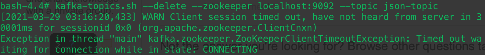

# Kafka

## 概念


> Broker（经纪人）

一个kafka应用实例，每个服务器上有一个或多个kafka的实例。


> Topic（主题）

每一则消息可以被指定一个主题，消息按照主题来分类。在每个broker上都可以创建多个topic。


> Partition（分区）

Topic的分区，每个topic可以有多个分区，分区的作用是做负载，提高kafka的吞吐量。同一个topic在不同的分区的数据是不重复的，partition的表现形式就是一个一个的文件夹！

* producer生产数据写入topic的分区时，如果指定key，那么就发送到指定的partition，否则轮训写入partiton。
* 每一个partition内部的数据是有顺序的，多个partition间的数据不保证时序。
* 关于如何设置partition值需要考虑的因素。一个partition只能被一个消费者消费（一个消费者可以同时消费多个partition），因此，如果设置的partition的数量小于consumer的数量，就会有消费者消费不到数据。所以，推荐partition的数量一定要大于同时运行的consumer的数量。另外一方面，建议partition的数量大于集群broker的数量，这样leader partition就可以均匀的分布在各个broker中，最终使得集群负载均衡。
* 分区分配原则
  * range
  * round robin
  * 使用`assign`分配给consumer指定区间的数据
* ==只能增加不能减少，且只能手动改变==


> Consumer Group

* 我们可以将多个消费者组成一个消费者组，在kafka的设计中同一个分区的数据只能被消费者组中的某一个消费者消费。同一个消费者组的消费者可以消费同一个topic的不同分区的数据。
* 同一个topic下的partition可以被不同消费者组中的消费者使用


## 使用

### 基本使用

> Docker 下载

* [wurstmeister/kafka](https://hub.docker.com/r/wurstmeister/kafka)
  
  * 10M+ Pulls
  
  ```shell
  docker pull wurstmeister/kafka
  ```
  
  
  
* [wurstmeister/zookeeper](https://hub.docker.com/r/wurstmeister/zookeeper) 
  
  * 绑定kafka使用
  
  ```shell
  docker pull wurstmeister/zookeeper
  ```
  
  


> 文档库

* [kafka-python](https://kafka-python.readthedocs.io/en/master/) 【Apache 官方python库】
* [pykafka](https://pykafka.readthedocs.io/en/latest/index.html)
* [kafka api doc](https://kafka.apache.org/documentation/#api)


> 文件位置信息

* kafka脚本文件位置
  *  `/opt/kafka_2.13-2.7.0/bin`
* kafka配置文件位置
  * `/opt/kafka/config/`


### Topic相关操作

* 查看topic

  ```shell
  kafka-topics.sh --bootstrap-server localhost:9092 --list
  ```

* 查看kafka特定topic详情

  ```shell
  kafka-topics.sh --bootstrap-server localhost:9092 --topic [topicName] --describe
  ```

* 创建topic

  ```shell
  # partition 数量不能超过broker数量
  kafka-topics.sh --bootstrap-server localhost:9092 --replication-factor 1 --partitions 1 --topic TestTopic --create
  ```

* 删除topic

  ```shell
  kafka-topics.sh --delete --bootstrap-server localhost:9092 --topic [topicName]
  ```

* 修改partition

  ```shell
  # 建议增加，不建议删除
  kafka-topics.sh --bootstrap-server localhost:9092 --alter --partitions 15 --topic [topicName]
  ```

* 查看kafka group信息

  ```shell
  kafka-consumer-groups.sh --bootstrap-server localhost:9092 --list
  ```

* 查看制定group信息

  ```shell
  kafka-consumer-groups.sh --bootstrap-server localhost:9092 --describe --group [group name]
  ```

* 查看topic下的message

  ```shell
  kafka-console-consumer.sh --bootstrap-server localhost:9092 --topic [topicName] --from-beginning
  
  kafka-console-consumer.sh --bootstrap-server localhost:9092 --topic [topicName] --from-beginning --max-messages 10
  ```

## Q&A

* 超时问题

  

  * 新版kafka使用--bootstrap-server 而不是 --zookeeper [link](https://stackoverflow.com/questions/66458973/exception-in-thread-main-kafka-zookeeper-zookeeperclienttimeoutexception-time)


## 参考

* Coding
  * [kafka-python](https://kafka-python.readthedocs.io/en/master/)
* Concept
  * [再过半小时，你就能明白kafka的工作原理了](https://zhuanlan.zhihu.com/p/68052232?utm_source=wechat_session)
  * [Kafka 设计与原理详解](https://blog.csdn.net/suifeng3051/article/details/48053965)
  * [Kafka — Core Concepts & Terminologies](https://medium.com/swlh/kafka-core-concepts-terminologies-dafa40aa9489)
  * [Diving Deep into Kafka](https://pub.towardsai.net/diving-deep-into-kafka-29160f32d408)


